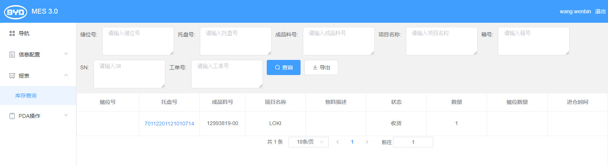
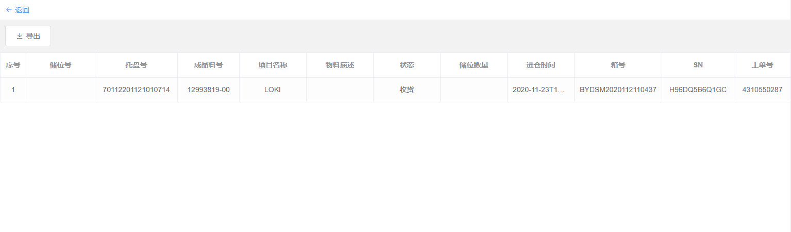

# Web FrontEnd Interview Project

test pr
It's a vue 2.x project built with ElementUI and Axios. You can only develop in the same framework, please check your task [here](#开发任务).

## Project Setup
[nodejs](https://nodejs.org/en/) is required
```bash
npm install
#or 
yarn install
```

### Compiles and hot-reloads for development
```bash
npm run serve
#or 
yarn serve
```

### Compiles and minifies for production
```bash
npm run build
#or 
yarn build
```

## 开发任务

### 接口定义
参见`api.http`，说明：使用`VS Code`可以调试`http`格式接口文档，但是本文档中的地址外网无法访问，仅供开发参考，开发时使用mock json即可。

接口中各字段定义，参见`src/views/StockReport.js`

### 界面需求

- 库存查询界面（PageLevel1），如下图


1. 支持储位号、托盘号、成品料号、项目名称、箱号、SN、工单号查询报表，接口名称：`bydGbWarehouseStock_getStockReportL1ByPage`
2. 报表需要分页，使用`bydGbWarehouseStock_getStockReportL1Count`接口获取所有数量；
3. 点击储位号或托盘号的链接，进入库存查询详情界面（PageLevel2），调用`bydGbWarehouseStock_getStockReportL2`接口传递当前点击的储位号和托盘号获取PageLevel2的数据；
4. 点击导出按钮，导出`public/mock/export.xlsx`表供用户下载
   
- 库存查询详情界面（PageLevel2），如下图


1. 点返回链接，页面跳转库存查询界面（PageLevel1）
2. 点击导出按钮，导出`public/mock/export.xlsx`表供用户下载
  
请先fork项目并新建分支，开发完成后提交PR即可。

## Mock Dev

In file `app.js`:
- Development: set `mock` to `true`
- Production: set `mock` to `false`
